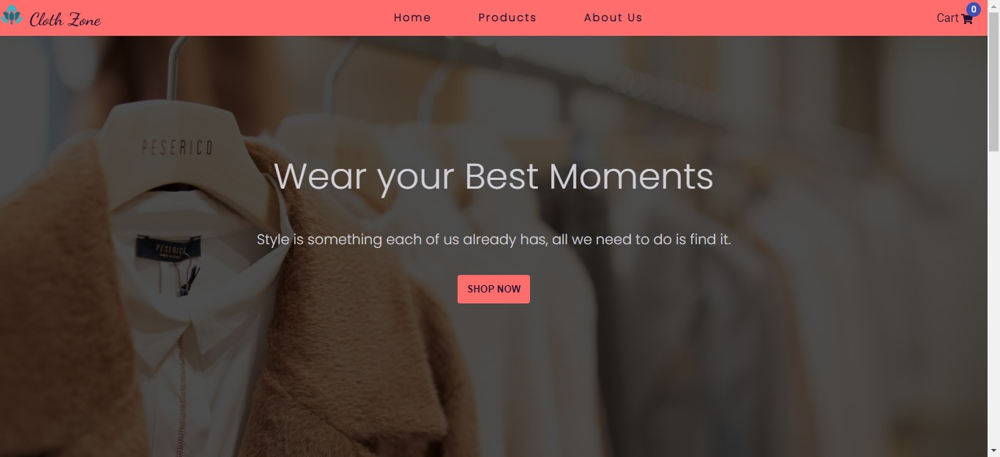

<h3> <a href="https://clothzone.netlify.app/">Cloth Zone </a></h3>

 
Cloth Zone is a Web Application created using React and Commerce JS Api. You can add items to cart and view them with the total price. You can checkout by filling the Shipping Address and you can also enter fake credit card details and you will get confirmation details. Created for learning and for a little fun.

You can use this repository for your projects if you want.
